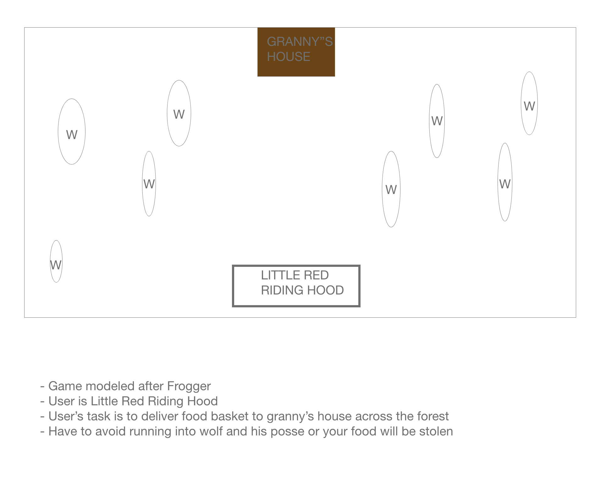
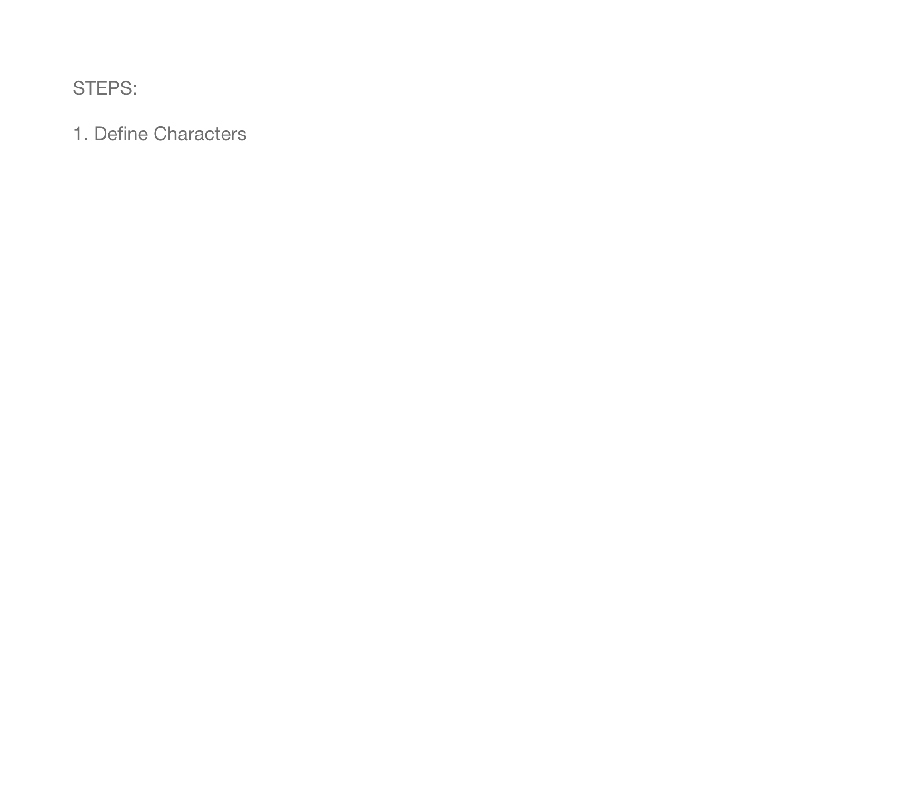

f1. Rules of the Game

-Get Red Riding Hood across the forrest to deliver basket to grandma
-Avoid Wolves

2. Technical Challenges

-_Get RRH across street
    - implement left/right/forward/backwards arrow keys
    <!-- key pressed functions -->

- Station Grandma's house in top center of screen (stationary)

<!-- Canvas Board (Environment)
  ship.show();
  ship.move(); -->

- create a code for replica of "Wolf" to appear on multiple parts of the sreen

- if Wolf and RRH overlap they both dissapear
  <!-- -if/else loops -->

3. Wireframe

4. Additional Features

-Add a time element?
-Implement levels in which it gets progressively harder
-Sound effects?

5. Timeline

- 07/01/2020

- Create Layout
  -Background grass/trees/"forresty"

- 07/02/2020

- 07/03/2020

- 07/04/2020

- 07/05/2020

- 07/06/2020

